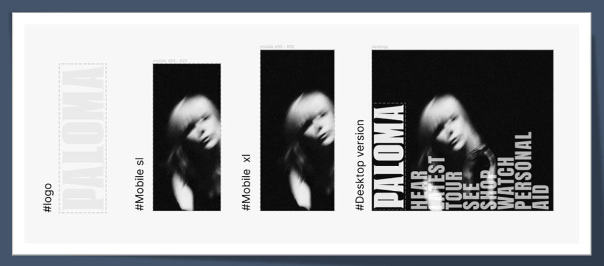
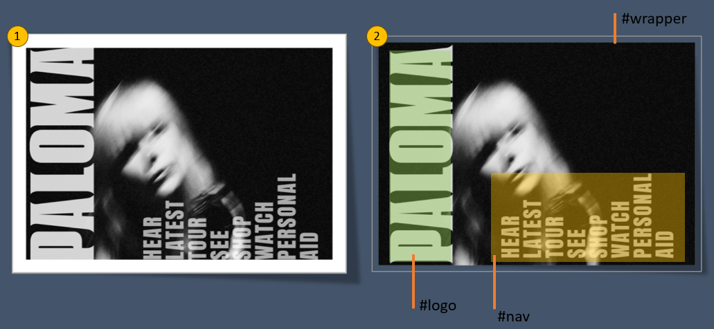
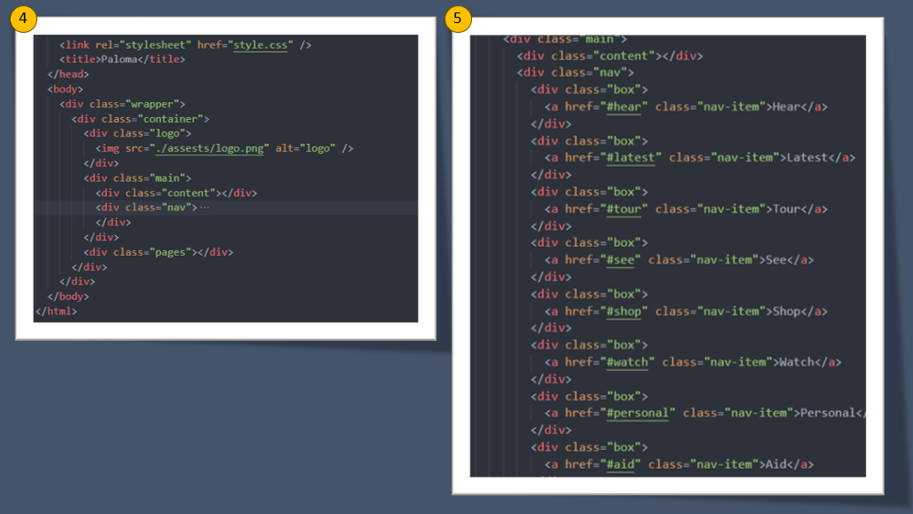
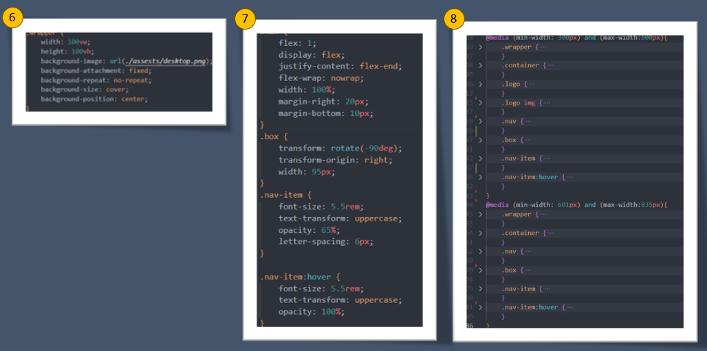

## Figma Design and Analysis

I started with inspecting the Figma art work that was supplied and exported the logo and images out and made a mock up on a sperate Figma board to visualise the look and feel across the different screens and devices.

This helps with planning out the HTML structure and the responsive layout

## Flexbox layout

I always like to plan out the various div elements that will be required to may basic structure using flex/ grid or a combination of both.  The design that was presented took me a bit of time to get my head around in order to achieve the desired outcome, but after a few tries and looking into the transform rotation documentation gave me a better understanding of how to get the desired outcome

## Html Structure

The whole layout was achieved using a basic wrapper container to house all the other div’s so that they would align correctly and can be targeted using flex box

In the nav section I decided to wrap the nav items (links) in a div labelled box so that I could apply 1 style element to using the transform: rotation to get the desired outcome

## CSS and Responsivness

The following code snippets demonstrate how the responsiveness for the background image was achieved as well as the responsiveness for the other screen devices

## Video Demo

[Watch the Video](https://github.com/ajdevbox/webui/blob/main/mdnotes/test.mp4)

Video demostration of testing across different devices

## URL Link

🛠 View here : https://ajdevbox.github.io/webui/

